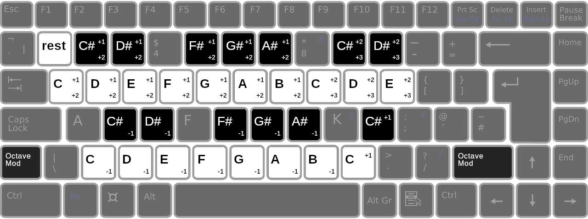

# Key Bindings

This document describes the default keyboard shortcuts in Bintracker. All key bindings can be modified through Bintracker's [configuration system](configuration.md). Plugins may register their own bindings, which are not listed here.

## Global

Key              | Function
-----------------|----------------------------------------
`Ctrl n`         | New module...
`Ctrl o`         | Open module file...
`Ctrl w`         | Close module
`Ctrl s`         | Save module
`Ctrl Shift s`   | Save module as...
                 |
`Ctrl q`         | Quit Bintracker
                 |
`Ctrl Tab`       | Focus next buffer
`Ctrl Shift Tab` | Focus previous buffer
                 |
`F1`             | Launch help in browser

## Module Edit

### Playback

Key              | Function
-----------------|----------------------------------------
`F5`             | Play from start
`F7`             | Play pattern
`F8`             | Stop playback

### Selection

Key                        | Function
---------------------------|----------------------------------------
`Shift up/down/left/right` | Select contents
`Ctrl a`                   | Select all of current blocks
`Ctrl Shift a`             | Select all blocks of current group

### Copy, Paste, Insert, Cut

Key                 | Function
--------------------|----------------------------------------
`Insert`            | Insert step in current block column
`Delete`            | Clear value under cursor (no shift)
`Backspace`         | Cut step from current block column (with shift)
`Control Insert`    | Insert row across block(s), (with shift)
`Control Backsapce` | Cut row across block(s), (with shift)
                    |
`Ctrl c`            | Copy selection (if any) or value under cursor
`Ctrl x`            | Clear selection (if any) or value under cursor (no shift)
`Ctrl Shift x`      | Cut selection (with shift)
`Ctrl v`            | Paste from clipboard (no shift, fills selection if any)
`Ctrl Shift v`      | Insert from clipboard (with shift, respects selection if any)
`Ctrl p`            | Porous paste under current data
`Ctrl Shift p`      | Porous paste over current data
                    |
`Ctrl Alt v`        | Swap selection with clipboard contents

### Transformations

Key                 | Function
--------------------|----------------------------------------
`Ctrl u`            | Transpose note up
`Ctrl d`            | Transpose note down
`Ctrl Shift u`      | Transpose octave up
`Ctrl Shift d`      | Transpose octave down
                    |
`Ctrl Alt u`        | Raise values by 1
`Ctrl Alt d`        | Lower values by 1
`Ctrl Alt Shift u`  | Raise values by logical unit (octave or 2^(bits/2))
`Ctrl Alt Shift u`  | Lower values by logical unit
                    |
`Ctrl i`            | Linear Interpolation
`Ctrl Shift i`      | Cosine Interpolation
                    |
`Ctrl l`            | Scale values
`Ctrl t`            | Invert values (min + max - x)
`Ctrl ?`            | Randomize selection
`Ctrl r`            | Reverse selection

### Note Entry

The main part of the keyboard functions like a two-row piano keyboard, as shown in the image below. Key `1` inserts a rest.

Notes on the lower half will use the current base octave, while the upper row will use the current base octave + 1. Holding `Shift` while entering a note will modify the note's octave. On the lower piano row, the base octave decreases by 1, on the upper row it increases by one.

In the following image, a number in the top right corner of a key represents the regular octave offset, and a number in the lower right corner represents the shifted octave offset.

### Other

Key                 | Function
--------------------|----------------------------------------
`.`                 | repeat last set value
`Tab`               | toggle focus between block view and order view

Numeric columns accept any number that is valid for the given command, using the radix (number base) set in `(settings 'number-base)`. Trigger commands accept any of the piano keys.

## REPL

Bindings for the REPL are not finalized yet.

Key              | Function
-----------------|----------------------------------------
`Return`         | Evaluate command
                 |
`Ctrl-L`         | Clear REPL
                 |
`Alt-P`          | Get previous command from history
`Alt-N`          | Get next command from history

There are a number of bindings that are not yet configurable. These are mostly standard shortcuts used by any modern text editor, ie. `Shift` + arrow keys selects, `Ctrl-C`/`Ctrl-X`/`Ctrl-V` copies/cuts/pastes, and so on.

## Screen Reader

These bindings assume you have a screen reader enabled in [`config.scm`](configuration.md).

Key              | Function
-----------------|----------------------------------------
`Alt-W`          | Report value under cursor (what?)
`Alt-Shift-W`    | Report location of cursor (where?)
